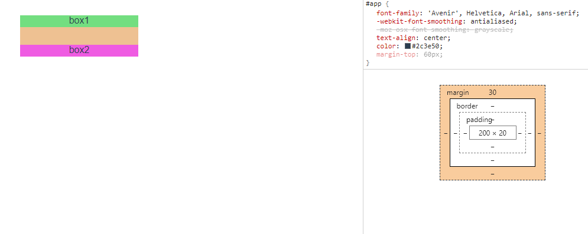

# 前置

在正式介绍 BFC 之前，我们先需要了解 Visual formatting model、Box Model 、定位方案的概念

## [Visual formatting model](https://developer.mozilla.org/en-US/docs/Web/CSS/Visual_formatting_model)

是用来处理和在视觉媒体上显示文档时使用的计算规则。该模型是 CSS 的基础概念之一。视觉格式化模型会根据 CSS 盒子模型将文档中的元素转换为一个个盒子。

## [Box Model](https://developer.mozilla.org/en-US/docs/Web/CSS/CSS_Box_Model/Introduction_to_the_CSS_box_model)

The CSS box model describes the rectangular boxes that are generated for elements in the document tree and laid out according to the visual formatting model.
盒模型可以简单理解成是 CSS 布局的对象和基本单位。一个页面由多个 Box 组成。并且 Box 也有会不同类型，他是根据元素的类型和 display 的属性来区分。。下面看下有哪些盒子。

- [块盒 block-level-box](https://www.w3.org/TR/CSS2/visuren.html#block-boxes) :Block-level elements are those elements of the source document that are formatted visually as blocks (e.g., paragraphs). The following values of the 'display' property make an element block-level: 'block', 'list-item', and 'table'. BFC.

* display 为 block，list-item 或 table
* 视觉上呈现为块，竖直排列；
* 块级盒参与(块格式化上下文)；

- [行内盒 inline-level-box](https://www.w3.org/TR/CSS2/visuren.html#inline-boxes) :Inline-level elements are those elements of the source document that do not form new blocks of content; the content is distributed in lines (e.g., emphasized pieces of text within a paragraph, inline images, etc.). The following values of the 'display' property make an element inline-level: 'inline', 'inline-table', and 'inline-block'. Inline-level elements generate inline-level boxes, which are boxes that participate in an inline formatting context. IFC.

* display 为 inline，inline-block 或 inline-table
* 视觉上它将内容与其它行内级元素排列为多行；典型的如段落内容，有文本(可以有多种格式譬如着重)，或图片，都是行内级元素；
* 行内级元素生成行内级盒(inline-level boxes)，参与行内格式化上下文(inline formatting context)。同时参与生成行内格式化上下文的行内级盒称为行内盒(inline boxes)。所有 display:inline 的非替换元素生成的盒是行内盒；

- [run-in-box](https://www.w3.org/TR/css-box-3/) :css3 中才有，暂不叙述

## 三种常见定位方案

### [普通流 Normal flow](https://developer.mozilla.org/en-US/docs/Learn/CSS/CSS_layout/Normal_Flow)

- 在普通流中，盒一个接着一个排列;
- 在块级格式化上下文里面， 它们竖着排列；
- 在行内格式化上下文里面， 它们横着排列;
- 当 position 为 static 或 relative，并且 float 为 none 时会触发普通流；

### [浮动 Floats](https://developer.mozilla.org/en-US/docs/Learn/CSS/CSS_layout/Floats)

在浮动布局中，元素首先按照普通流的位置出现，然后根据浮动的方向尽可能的向左边或右边偏移，其效果与印刷排版中的文本环绕相似。

### 绝对定位(Absolute positioning)

在绝对定位布局中，元素会整体脱离普通流，因此绝对定位元素不会对其兄弟元素造成影响，而元素具体的位置根据距其最近一个不为 static 的父级元素通过 top, bottom, left, right 定位

# 定义

BFC（Block Formatting Context）格式化上下文，是 Web 页面中盒模型布局的 CSS 渲染模式，指一个独立的渲染区域或者说是一个隔离的独立容器。

# 形成条件

- 根元素（html）
- 浮动元素（元素的 float 不是 none）
- 绝对定位元素（元素的 position 为 absolute 或 fixed）
- 行内块元素（元素的 display 为 inline-block）
- 表格单元格（元素的 display 为 table-cell，HTML 表格单元格默认为该值）
- 表格标题（元素的 display 为 table-caption，HTML 表格标题默认为该值）
- 匿名表格单元格元素（元素的 display 为 table、table-row、 table-row-group、table-header-group、table-footer-group（分别是 HTML table、row、tbody、thead、tfoot 的默认属性）或 inline-table）
- overflow 值不为 visible 的块元素
- display 值为 flow-root 的元素
- contain 值为 layout、content 或 paint 的元素
- 弹性元素（display 为 flex 或 inline-flex 元素的直接子元素）
- 网格元素（display 为 grid 或 inline-grid 元素的直接子元素）
- 多列容器（元素的 column-count 或 column-width 不为 auto，包括 column-count 为 1）
- column-span 为 all 的元素始终会创建一个新的 BFC，即使该元素没有包裹在一个多列容器中（标准变更，Chrome bug）。

# 特性

- 内部的 box 会在垂直方向上一个接一个的放置
- 垂直方向上的距离由 margin 决定
- bfc 的区域不会与 float 的元素区域重叠
- 计算 BFC 的高度时，浮动元素也参与计算
- BFC 就是页面上的一个独立容器，容器里面的字元素不会影响外面的元素

# 🌰

## 边距折叠

在常规文档流中，两个兄弟盒子之间的垂直距离是由他们的外边距所决定的，但不是他们的两个外边距之和，而是以较大的为准。

```js
 // html
 <div class="container">
   <div class="box1">box1</div>
   <div class="box2">box2</div>
 </div>
 // css
 .container {
   width: 200px;
   top: 50%;
   background: #e0e0e0;
   position: absolute;
   left: 50%;
   transform: translate(-50%, -50%);

   .box1 {
     background: #73de80;
     margin-bottom: 20px;
   }
   .box2 {
     background: #ef5be2;
     margin-top: 30px;
   }
 }
```


当 box1 或 box2 再处于另一个 BFC 中的时候，就可以边距不折叠。

```js
 // html
 <div class="container">
   <div class="box1">box1</div>
   <div class="wrapper">
     <div class="box2">box2</div>
   </div>
 </div>
 // css
 .container {
   width: 200px;
   top: 50%;
   background: #e0e0e0;
   position: absolute;
   left: 50%;
   transform: translate(-50%, -50%);

   .wrapper {
     overflow: hidden;
   }
   .box1 {
     background: #73de80;
     margin-bottom: 20px;
   }
   .box2 {
     background: #ef5be2;
     margin-top: 30px;
   }
 }
```


## 高度塌陷

在使用浮动后，元素会脱离文档流，造成高度塌陷的问题


```js
 // html
    <div class="container">
      <div class="box1">box1</div>
      <div class="box2">box2</div>
      <div class="box3">box3</div>
      <div class="box4">box4</div>
    </div>
 // css
 .container {
  width: 200px;
  top: 50%;
  background: #e0e0e0;

  .box1 {
    background: #73de80;
    float: left;
  }
  .box2 {
    background: #ef5be2;
    position: absolute;
    float: left;
  }
  .box3 {
    background: yellowgreen;
    width: 100px;
    float: left;
  }
  .box4 {
    background: skyblue;
    float: left;
  }
}
```

想要解决该问题，可以在尾部添加一个元素，并设置 clear:both 属性，或者使用 br 标签和其自身的 html 属性（br 有 clear=“all | left | right | none” 属性），
但这些有违 结构与表现的分离，不推荐使用，
这时候可以在父元素创建 bfc 来闭合浮动，解决高度塌陷的问题。


## 两栏布局

bfc 中有个特性*bfc 的区域不会与 float 的元素区域重叠* ，利用这一特性，我们可以实现一个两栏自适应布局

```js
    <style>
      .left {
        background: #73de80;
        float: left;
      }
      .right {
        background: #ef5be2;
        overflow: hidden;
      }
    </style>
    <div class="left">浮动</div>
    <div class="right">自适应</div>
```

在这一基础上加深一点，在给右侧加一个浮动区域，就可以实现常见的双飞翼布局。

```js
    <style>
      .left {
        background: #73de80;
        float: left;
      }
      .right {
        background: #ef5be2;
        float:right;
      }
      .center{
        background:black;
        overflow: hidden;
      }
    </style>
    <div class="left">浮动-左</div>
    <div class="right">浮动-右</div>
    <div class="center">自适应</div>
```

这里注意，不要把 right 放在 center 后面，不然 right 会被挤下去。
原因是因为*bfc 的区域不会与 float 的元素区域重叠*，center 只会受到 left 的影响，因此会铺满右边，right 被挤到下一行

# 总结

bfc 是页面 CSS 视觉渲染的一部分，用于决定块盒子的布局及浮动相互影响范围的一个区域。巧妙的利用 bfc，可以解决许多布局、定位等问题。
