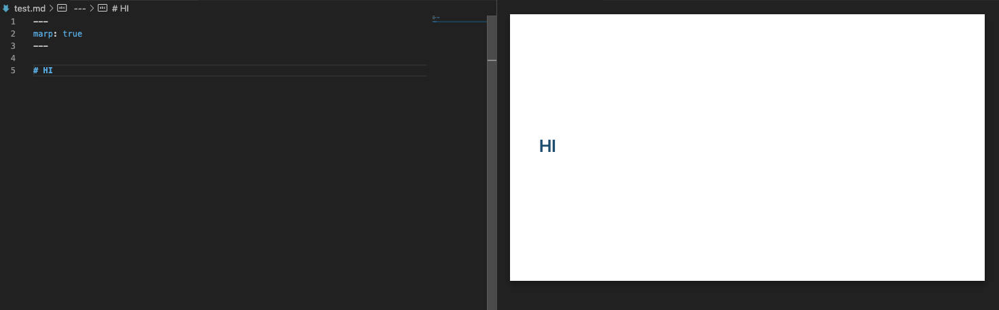
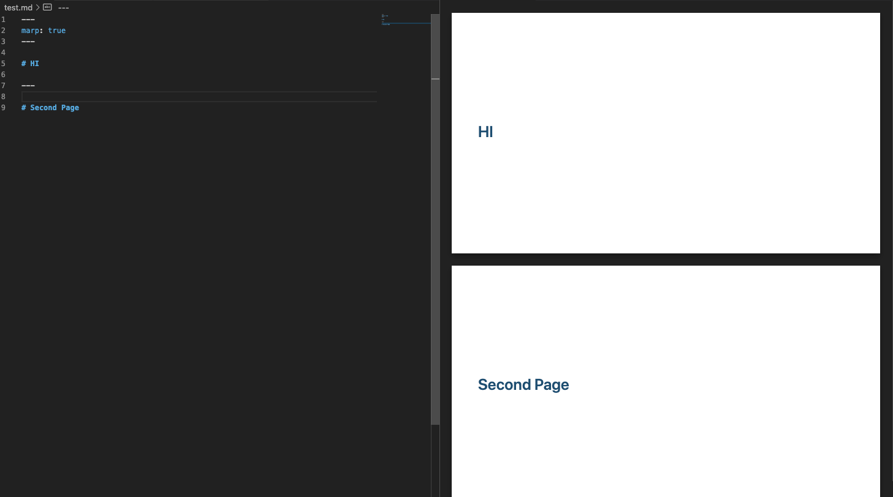

# 背景
在日常工作中，经常会有一些分享，或者汇报。在写ppt之前，我一般会去搜集材料，并用markdown记录下来，后面再去写ppt，但是写ppt是一件头疼的事情，这时候发现Marp可以帮我们把markdown转成ppt。直接开冲。

# 安装
在vscode extensions中搜索 Marp for VS Code 并下载。

# 快速使用

首先，设置 marp为true，打开marp

```js
---
marp: true
---
```

也可以点击右上角的marp图标 ，然后选择 `Toggle Marp preview for current Markdown". (markdown.marp.toggleMarpPreview).` 这时候，右边会出现预览界面


在Marp中，使用 `---` 进行分页


还可以通过写css来设置页面样式，用起来和写页面一样
```js
<style>
section.example{
  text-align: center;
  font-size:48px;
  color:gray;
}
</style>
<!-- _class: example -->

# 🌰
这是一个栗子
```


还可以设置主题、图片排版等，具体看[官方文档](https://marpit.marp.app/)