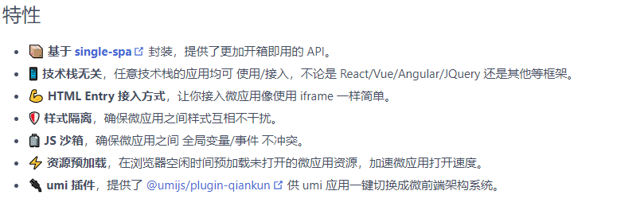
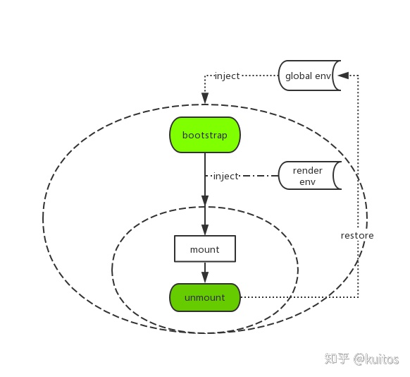
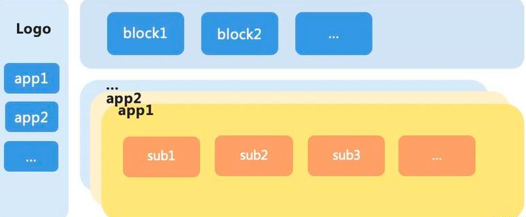

# 背景

在简单分析了 single-spa 的实现后，会发现在 single-spa 中，通过 reroute 和路由控制不断地在调度子应用，加载子应用的代码，切换子应用，改变子应用的 app.status。所以 single-spa 解决了一个子应用之间的调度问题。并且，single-spa 有一个开放的地方，那就是 registerApplication 中引入子应用的加载函数。

qiankun 就做了这样的事，qiankun 是阿里团队基于 single-spa、import-html-entry 进行二次开发的一个微前端实现库，该库解决了许多当前微前端所碰到的问题，并且有许多有意思的特性，本文主要对于其特性进行剖析。

先上一张特性图

可以看到，qiankun 特性有许多，本文就对我个人感兴趣的 _HTML Entry 接入方式_ _样式隔离_ _JS 沙箱_ _资源预加载_,这 4 个特性进行分析

## HTML Entry 接入方式

在微前端解决方案中，single-spa 采用的是 JS Entry 。但这个方案的限制也颇多，如要求子应用的所有资源打包到一个 js bundle 里，包括 css、图片等资源。除了打出来的包可能体积庞大之外的问题之外，资源的并行加载等特性也无法利用上。而 qiankun 采用了 HTML Entry ，HTML Entry 则更加灵活，直接将子应用打出来 HTML 作为入口，主框架可以通过 fetch html 的方式获取子应用的静态资源，同时将 HTML document 作为子节点塞到主框架的容器中。这样不仅可以极大的减少主应用的接入成本，子应用的开发方式及打包方式基本上也不需要调整，而且可以天然的解决子应用之间样式隔离的问题。

qiankun 主要是通过 _import-html-entry_ 这个库实现以*html*做为入口

可以看下激活时，是怎么做的。

```js
const { template, execScripts, assetPublicPath } = await importEntry(
  entry,
  importEntryOpts
);
```

这里看到 用了*import-html-entry* 中的 *importEntry*方法。其中返回了三个字段

- template: 被处理后的 html 模板字符串，外联的样式文件被替换为内联样式
- execScripts: 执行所有的 script 中的代码，并返回为 html 模板入口脚本链接 entry 指向的模块导出对象。
- assetPublicPath:静态资源的 baseURL

```js
// 获取appContent
const appContent = getDefaultTplWrapper(appInstanceId, appName)(template);
···
const scopedCSS = isEnableScopedCSS(sandbox);
let initialAppWrapperElement: HTMLElement | null = createElement(
  appContent,
  ···
);
···
// 渲染 将 HTML 挂载在指定容器中
render({ element: initialAppWrapperElement, loading: true, container: initialContainer }, 'loading');
···
// 执行html中的脚本，获取相应生命周期钩子
const scriptExports: any = await execScripts(global, !useLooseSandbox);
const { bootstrap, mount, unmount, update } = getLifecyclesFromExports(
  scriptExports,
  appName,
  global,
  sandboxContainer?.instance?.latestSetProp,
);
```

## 样式隔离

因为 qiankun 用了 HTML 的引入方式，因此样式隔离会变得异常简单和自然。在 HTML Entry 模式下，子应用加载完成的后的 DOM 结构可能长这样：

```js
<html>

  <body>
    <main id="subApp">
      // 子应用完整的 html 结构
      <link rel="stylesheet" href="//alipay.com/subapp.css">
      <div id="root">....</div>
    </main>
  </body>

</html>
```

当子应用被替换或卸载时，subApp 节点的 innerHTML 也会被复写，//alipay.com/subapp.css 也就自然被移除样式也随之卸载了。

## JS 沙箱

先看一下官方的 JS 沙箱简单架构图

在应用的 bootstrap 及 mount 两个生命周期开始之前分别给全局状态打下快照，然后当应用切出/卸载时，将状态回滚至 bootstrap 开始之前的阶段，确保应用对全局状态的污染全部清零。而当应用二次进入时则再恢复至 mount 前的状态的，从而确保应用在 remount 时拥有跟第一次 mount 时一致的全局上下文。

看下源码是如何实现的。

```js
 let global = window;
  let mountSandbox = () => Promise.resolve();
  let unmountSandbox = () => Promise.resolve();
  const useLooseSandbox = typeof sandbox === 'object' && !!sandbox.loose;
  let sandboxContainer;
  // 如果没开沙箱，那么全局环境都是window，容易造成状态污染
  if (sandbox) {
    sandboxContainer = createSandboxContainer(
      appName,
      initialAppWrapperGetter,
      scopedCSS,
      useLooseSandbox,
      excludeAssetFilter,
    );
    // 用沙箱的代理对象作为接下来使用的全局对象
    global = sandboxContainer.instance.proxy as typeof window;
    mountSandbox = sandboxContainer.mount;
    unmountSandbox = sandboxContainer.unmount;
  }
```

进入到*createSandboxContainer*，看下如何创建 JS 沙箱

```js
let sandbox: SandBox;
if (window.Proxy) {
  sandbox = useLooseSandbox
    ? new LegacySandbox(appName)
    : new ProxySandbox(appName);
} else {
  sandbox = new SnapshotSandbox(appName);
}
```

可以看到目前有三种沙箱：_LegacySandbox_ 、_ProxySandbox_ 、_SnapshotSandbox_。
并且通过是否支持*window.Proxy* 分为 _LegacySandbox_ 和 _SnapshotSandbox_ 两种，，legacySandBox 仅用于 singular 单实例模式，而多实例模式会使用 proxySandBox。

### LegacySandbox

先看下整体结构

```js
export default class SingularProxySandbox implements SandBox {
  /** 沙箱期间新增的全局变量 */
  private addedPropsMapInSandbox = new Map<PropertyKey, any>();

  /** 沙箱期间更新的全局变量的初始值 */
  private modifiedPropsOriginalValueMapInSandbox = new Map<PropertyKey, any>();

  /** 持续记录更新的(新增和修改的)全局变量的 map，用于在任意时刻做 snapshot */
  private currentUpdatedPropsValueMap = new Map<PropertyKey, any>();

  name: string;

  //代理对象，可以理解为子应用的 global/window 对象
  proxy: WindowProxy;

  type: SandBoxType;
  //当前沙箱是否在运行中
  sandboxRunning = true;

  latestSetProp: PropertyKey | null = null;
  //激活沙箱，在子应用挂载时启动
  active() {
  }
  //关闭沙箱，在子应用卸载时启动
  inactive() {
  }
  //构造函数，创建沙箱环境
  constructor(name: string) {
  }
}
```

qiankun 是从 window.Proxy 的 set 和 get 属性来实现沙箱运行环境。

```js
    const proxy = new Proxy(fakeWindow, {
      set(_: Window, p: PropertyKey, value: any): boolean {
        // 沙箱是否在运行中
        if (self.sandboxRunning) {
          // 是否存在该属性
          if (!rawWindow.hasOwnProperty(p)) {
            // 不存在 增加全局变量
            addedPropsMapInSandbox.set(p, value);
          } else if (!modifiedPropsOriginalValueMapInSandbox.has(p)) {
            // 如果当前 window 对象存在该属性，且 record map 中未记录过，则记录该属性初始值
            const originalValue = (rawWindow as any)[p];
            modifiedPropsOriginalValueMapInSandbox.set(p, originalValue);
          }
          currentUpdatedPropsValueMap.set(p, value);
          // 必须重新设置 window 对象保证下次 get 时能拿到已更新的数据
          (rawWindow as any)[p] = value;

          self.latestSetProp = p;

          return true;
        }
        // do something
        return true;
      },

      get(_: Window, p: PropertyKey): any {
        if (p === 'top' || p === 'parent' || p === 'window' || p === 'self') {
          return proxy;
        }
        const value = (rawWindow as any)[p];
        // 会对函数进行绑定this 指定其指向
        return getTargetValue(rawWindow, value);
      },
      has(_: Window, p: string | number | symbol): boolean {
        return p in rawWindow;
      },
    });
```

然后在激活沙箱时候，还原子应用状态。在关闭沙箱时，还原主应用状态

```js
  active() {
    if (!this.sandboxRunning) {

      this.currentUpdatedPropsValueMap.forEach((v, p) => setWindowProp(p, v));
    }

    this.sandboxRunning = true;
  }

  inactive() {
    if (process.env.NODE_ENV === 'development') {
      console.info(`[qiankun:sandbox] ${this.name} modified global properties restore...`, [
        ...this.addedPropsMapInSandbox.keys(),
        ...this.modifiedPropsOriginalValueMapInSandbox.keys(),
      ]);
    }
    // 还原修改过的值
    this.modifiedPropsOriginalValueMapInSandbox.forEach((v, p) => setWindowProp(p, v));
    // 删除新增的值
    this.addedPropsMapInSandbox.forEach((_, p) => setWindowProp(p, undefined, true));

    this.sandboxRunning = false;
  }
```

### ProxySandbox

在 qiankun ProxySandbox 用于多实例场景。什么是多实例场景，这里我简单提下，一般我们的中后台系统同一时间只会加载一个子应用的运行时。但是也存在这样的场景，某一个子应用聚合了多个业务域，这样的子应用往往会经历多个团队的多个同学共同维护自己的业务模块，这时候便可以采用多实例的模式聚合子模块（这种模式也可以叫微前端模块）。

和 legacySandBox 最直接的不同点就是，为了支持多实例的场景，proxySandBox 不会直接操作 window 对象。并且为了避免子应用操作或者修改主应用上诸如 window、document、location 这些重要的属性，会遍历这些属性到子应用 window 副本（fakeWindow）上


先看下 ProxySandbox 结构

```js

export default class ProxySandbox implements SandBox {
  /** window 值变更记录 */
  // 记录沙箱中更新的值，也就是每个子应用中独立的状态池
  private updatedValueSet = new Set<PropertyKey>();

  name: string;

  type: SandBoxType;
  // 代理对象，可以理解为子应用的 global/window 对象
  proxy: WindowProxy;
  // 当前沙箱是否在运行中
  sandboxRunning = true;
  // 最近设置的PropertyKey
  latestSetProp: PropertyKey | null = null;
  // 激活沙箱，在子应用挂载时启动
  active() {
  }
  // 关闭沙箱，在子应用卸载时启动
  inactive() {
  }

  constructor(name: string) {
  }
}
```

然后看下 ProxySandbox 是如何实现沙箱运行环境

todo

## 资源预加载

todo
