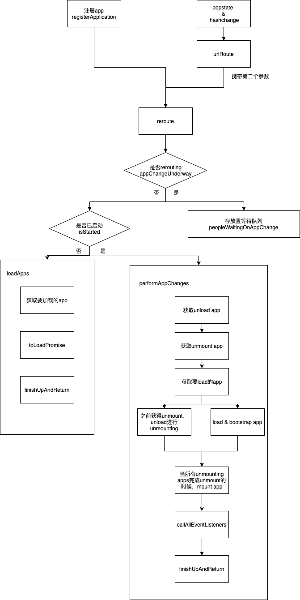

# 前言
当前公司使用的qp框架是基于single-spa、qiankun开发，但对于原理只是一知半解，甚至不懂，因此有必要进行相关了解。

# 流程图


# 整体流程
主要分为4步骤
1. 微应用抛出相关生命周期 （singleSpaReact、singleSpaVue、singleSpaAngular）
2. 容器注册微应用 （registerApplication），执行`reroute`方法。
3. 启动 （start），执行`reroute`方法。
4. 监听 `hashchange` 和 `popstate`事件进行url拦截，当路由变化会根据相应规则挂载/卸载相应的微应用，并执行`reroute`方法。

可以看出`reroute`为核心模块，下面我们依次分析。

## 微应用抛出相关生命周期
微应用抛出相关生命周期
### 生命周期函数
  * load：加载
  * bootstrap：启动
  * mount：挂载
  * unmount：移除挂载
  * unload：卸载

## 容器注册微应用
### [参数](https://zh-hans.single-spa.js.org/docs/configuration)
  * name：微应用标示
  * Loading Function or Application：微应用/微应用引用路径
  * activeWhen：何时激活微应用，一般通过路由前缀进行判断
  * customProps：自定义参数，传递给微应用的参数


### 源码分析

#### 状态
在进行源码分析前，我们需要知道在single-spa中定义了哪几个应用状态
  *  NOT_LOADED：注册未加载
  *  LOADING_SOURCE_CODE：正在加载微应用源码
  *  NOT_BOOTSTRAPPED：已加载，未启动
  *  BOOTSTRAPPING：正在启动，生命周期重的boostrap只执行一次
  *  NOT_MOUNTED：已启动，未挂载
  *  MOUNTING：挂载中，处于生命周期中mount时期
  *  MOUNTED：已挂载
  *  UNMOUNTING：正在移除挂载，生命周期中unmount时期
  *  UNLOADING：卸载中
  *  SKIP_BECAUSE_BROKEN：执行期间出错

#### registerApplication
registerApplication主要是用于检查传入的参数是否正确，并住注册应用，最后会执行`reroute`方法。
```js
export function registerApplication(appName, arg1, arg2, customProps = {}) {
  //检查是否存在合法的appname
  if (typeof appName !== 'string' || appName.length === 0)
    throw new Error(`The first argument must be a non-empty string 'appName'`);
    //检查该appName是否已经存在
  if (getAppNames().indexOf(appName) !== -1)
    throw new Error(`There is already an app declared with name ${appName}`);
  if (typeof customProps !== 'object')
    throw new Error('customProps must be an object');

  let loadImpl, activeWhen;
  if (!arg2) {
    if (!Loader) {
      throw new Error(`You cannot declare a single-spa application without either providing a way to load the application or a Loader. See https://github.com/CanopyTax/single-spa/blob/master/docs/single-spa-api.md#declareApplication`);
    }
    loadImpl = () => Loader.import(appName);
    activeWhen = arg1;
  } else {
    if (typeof arg1 !== 'function') {
      loadImpl = () => Promise.resolve(arg1)
    } else {
      loadImpl = arg1;
    }
    activeWhen = arg2;
  }
  if (typeof activeWhen !== 'function')
    throw new Error(`The activeWhen argument must be a function`);

  apps.push({
    name: appName,
    loadImpl,
    activeWhen,
    status: NOT_LOADED,
    customProps: customProps
  });
// 开启JquerySupport
  ensureJQuerySupport();
// 执行reroute           关键✨
  reroute();
}
```

### reroute

```js
/*
pendingPromises：表示正在队列中等待执行的 reroute。reroute 在执行期间，可能会有多个 reroute 被调用（路由触发或者应用注册）。
eventArguments：路由事件触发的 event。只有路由改变才会有这个参数
*/
/**
 * @params pendingPromises 等待的promise列表，会存在多个reroute被调用的情况（注册、路由触发）
 * @params eventArguments 事件参数，只有路由改变才会有此参数
 */
// appChangeUnderway 是一个开关，用来表示 reroute 是否正处于执行期间。
let appChangeUnderway = false, peopleWaitingOnAppChange = [];

export function reroute(pendingPromises = [], eventArguments) {
  // 判断是reroute是否正在执行
  if (appChangeUnderway) {
    return new Promise((resolve, reject) => {
      peopleWaitingOnAppChange.push({
        resolve,
        reject,
        eventArguments,
      });
    });
  }

  appChangeUnderway = true;
  // wasNoOp:是否有应用发生变更
  let wasNoOp = true;

// isStarted: 是否已启动
  if (isStarted()) {
    // 执行应用程序更改
    return performAppChanges();
  } else {
    // 加载apps  注册微应用
    return loadApps();
  }

  async function loadApps() {
    // 1. 加载apps(没有出错 && (未加载过 || 正在加载中) && 匹配当前路由)
    // 2. 加载微应用，状态置为 NOT_BOOTSTRAPPED
    // 3. 如果成功加载，wasNoOp 置为 false
    // 4. 调用 finishUpAndReturn方法
  }
  //performAppChanges 是触发事件和生命周期函数的地方
  async function performAppChanges() {
    // 1. 找到要unload的app
    // 2. 找到要unmount的app
    // 3. 找到要load的app
    // 4. unmounting load bootstrap
    // 5. 挂载（在umounting都完成后后执行）(mount事件)
    // 6. callAllEventListeners
    // 7. 执行 finishUpAndReturn
  }

  // reroute结束代码，用以发出结束事件，并检查是否还有reroute事件，递归执行，返回mountedApps
  function finishUpAndReturn(callEventListeners=true) {
    //获取已经挂载的app
    const returnValue = getMountedApps();

    if (callEventListeners) {
      callAllEventListeners();
    }
    pendingPromises.forEach(promise => promise.resolve(returnValue));

    try {
      const appChangeEventName = wasNoOp ? "single-spa:no-app-change": "single-spa:app-change";
      window.dispatchEvent(new CustomEvent(appChangeEventName));
      window.dispatchEvent(new CustomEvent("single-spa:routing-event"));
    } catch (err) {
      /* We use a setTimeout because if someone else's event handler throws an error, single-spa
       * needs to carry on. If a listener to the event throws an error, it's their own fault, not
       * single-spa's.
       */
      setTimeout(() => {
        throw err;
      });
    }

    /* Setting this allows for subsequent calls to reroute() to actually perform
     * a reroute instead of just getting queued behind the current reroute call.
     * We want to do this after the mounting/unmounting is done but before we
     * resolve the promise for the `reroute` async function.
     */
     // 表示reroute结束
    appChangeUnderway = false;

    // 如果在rerouting中有其他的reroute，执行等待的reroute
    if (peopleWaitingOnAppChange.length > 0) {
      /* While we were rerouting, someone else triggered another reroute that got queued.
       * So we need reroute again.
       */
      const nextPendingPromises = peopleWaitingOnAppChange;
      peopleWaitingOnAppChange = [];
      reroute(nextPendingPromises);
    }

    return returnValue;
  }

  function callAllEventListeners() {
    // do something
  }
}

```

## Single-Spa-FronteFramework
前面我们提到，在`performAppChanges`中会去执行相应的生命周期。而这些是在`single-spa-vue`、`single-spa-react`等相应的前端框架定义的方法。
* `bootstrap` 确保传入的是相应的根组件
* `mount` 将相应的app去挂载到根结点下
* `unmount` 移除dom节点
